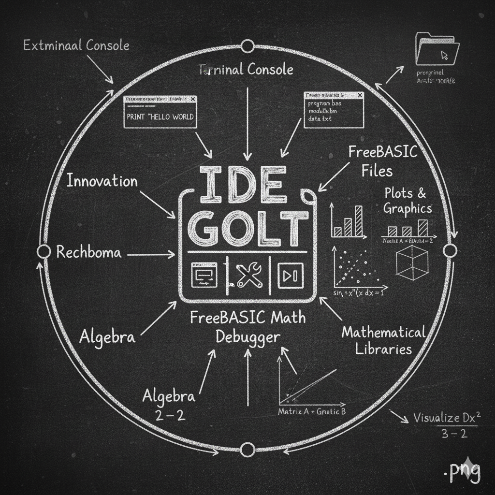

Here is a recommended README.md template for your FreeBASIC project named "./veshgolt" that includes desktop development, math solver plots, terminal console, debugging files, and Freebasic scripting:



```markdown
# IDEGolt - FreeBASIC Desktop & Development Project

## Overview
IDEGolt is a FreeBASIC-based desktop project located in `./veshgolt`. It features a math solver with plotting capabilities, terminal console interface, and integrated debugging support.

## Project Structure
- `src/` - Source FreeBASIC `.bas` scripts for math solver, UI, plots, and console
- `debug/` - Debugger helper files for step-through debugging and logging
- `plots/` - Script files managing math function plotting and graph rendering
- `build/` - Compiled binaries and output executables
- `docs/` - Documentation and usage guides

## Features
- Math solver script capable of solving algebraic expressions, numeric equations, and generating plots
- Terminal console interface for user input and output display
- Plot rendering using FreeBASIC graphical commands
- Debugger integration files supporting breakpoints and variable watches
- Modular development enabling easy extension and scripting customization

## Getting Started
1. Install FreeBASIC compiler if not already installed (https://www.freebasic.net/download/)
2. Open your terminal or preferred IDE that supports FreeBASIC (e.g., FBIDE, Geany)
3. Navigate to the project folder:
   ```
   cd ./veshgolt/src
   ```
4. Compile the main program:
   ```
   fbc main.bas
   ```
5. Run the executable:
   ```
   ./main.exe
   ```
6. Use the terminal interface to input math problems or commands for plotting

## Debugging
- Use included debugging scripts in `/debug` for enhanced tracing
- Customize breakpoint and watch points via provided helpers

## Contributing
Feel free to fork the repository and submit pull requests. Please follow FreeBASIC coding conventions for readability and maintainability.

## License
This project is licensed under [Your Chosen License] - see the LICENSE file for details.

---

For further inquiries, visit the documentation in `/docs` or contact the maintainer.
```

This README guides users on the project layout, features, setup, usage, and development notes suitable for a FreeBASIC math solver and IDE desktop project named `veshgolt`. Adjust paths and licensing as per your exact implementation.[1][3][4][5][7]

[1-freebasic](https://www.freebasic.net/forum/viewtopic.php?t=6887)
[2-freebasic](https://freebasic.net/forum/viewtopic.php?t=24486)
[3-freebasic](https://www.freebasic.net/forum/viewtopic.php?t=10391)
[4-freebasic](https://www.freebasic.net/forum/viewtopic.php?t=26541)
[5-freebasic](https://www.freebasic.net/forum/viewtopic.php?t=10350)
[6-freebasic](https://www.freebasic.net/forum/viewtopic.php?t=28651)
[7-freebasic](https://www.freebasic.net/forum/viewtopic.php?t=28347)
[8-freebasic](https://www.freebasic.net/forum/viewtopic.php?t=10240)
[9-freebasic](https://freebasic.net/forum/viewtopic.php?t=20916)